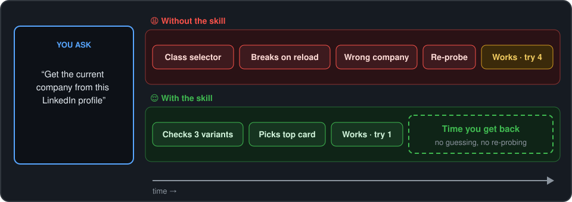

# 🔗🕵️ LinkedIn AI Skill


> An AI agent skill that helps you scrape LinkedIn pages reliably.

[](LICENSE.txt) [](https://github.com/anthropics/skills) [](https://github.com/adriangrantdotorg/linkedin-ai-skill/releases) [](https://github.com/adriangrantdotorg/linkedin-ai-skill/pulls)

---

## ⬇️ Why Install?

- 🎯 **Right company, first try** — never grabs a feed post or school by mistake
- 🔁 **Survives LinkedIn's reshuffles** — works across every known page variant
- 💸 **$0 added cost** — runs inside the AI you already use
- 🧩 **No setup** — one Markdown file, no packages, no build

---

## ✨ Features

The skill starts from one fact most AIs miss: LinkedIn serves a different layout of the same page on each load, so it checks every known variant and picks by position, not by class name.



- 🏢 **Current company from any profile** — a ready-to-run scraper for all three top-card layouts
- 💼 **Jobs pages mapped** — stable anchors for job cards, details, filters and the scroll container
- 📡 **Data the page never rendered** — job descriptions and company websites via LinkedIn's own internal API
- 🚫 **Dead ends skipped** — no time wasted on meta tags, JSON-LD or old data blobs
- 🩺 **A debugging routine that finds the real cause** — probe the live tab, list candidates, test on fresh loads

---

## 🚀 Installation

Needs an AI assistant that supports [Agent Skills](https://github.com/anthropics/skills) and a Chromium browser you're logged in to LinkedIn with. For scripts that drive Chrome, turn on **View ▸ Developer ▸ Allow JavaScript from Apple Events**.


---

```bash
# Claude Code
git clone https://github.com/adriangrantdotorg/linkedin-ai-skill.git ~/.claude/skills/linkedin-ai-skill
# Cursor
git clone https://github.com/adriangrantdotorg/linkedin-ai-skill.git ~/.cursor/skills/linkedin-ai-skill
# ChatGPT & Codex
git clone https://github.com/adriangrantdotorg/linkedin-ai-skill.git ~/.agents/skills/linkedin-ai-skill
```

| **Platform** | **Skills folder** |
| --- | --- |
| **[Claude Code](https://code.claude.com/docs/en/skills)** | `~/.claude/skills/` |
| **[Cursor](https://cursor.com/docs/skills)** | `~/.cursor/skills/` |
| **[ChatGPT & Codex](https://learn.chatgpt.com/docs/build-skills)** | `~/.agents/skills/` |

## 💡 Usage

Ask for LinkedIn data as usual; the skill kicks in on its own.

| You say | The skill makes |
| --- | --- |
| "Get the current company from this LinkedIn profile." | A **JavaScript scraper** that checks every layout and returns the top-card company |
| "Grab the full description of this LinkedIn job, even in a background tab." | A **same-origin API call** with the right headers, cached and failing softly |
| "My LinkedIn scraper suddenly returns the wrong company." | A **debugging run** against the live tab that finds the new variant |

---

<div align="center">
  <sub>Built with ❤️ for the AI automation community & everyone tired of broken selectors ✌🏾</sub>
</div>
